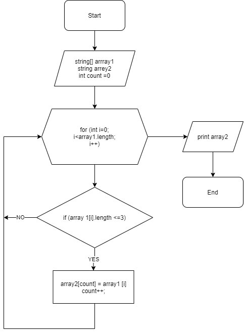

# **Итоговая проверочная работа**

# Задание

1.	Создать репозиторий на GitHub
2.	Нарисовать блок-схему алгоритма (можно обойтись блок-схемой основной содержательной части, если вы выделяете ее в отдельный метод)
3.	Снабдить репозиторий оформленным текстовым описанием решения (файл README.md)
4.	Написать программу, решающую поставленную задачу
5.	Использовать контроль версий в работе над этим небольшим проектом (не должно быть так, что все залито одним коммитом, как минимум этапы 2, 3 и 4 должны быть расположены в разных коммитах)

    Задача: Написать программу, которая из имеющегося массива строк формирует массив из строк, длина которых меньше либо равна 3 символа. Первоначальный массив можно ввести с клавиатуры, либо задать на старте выполнения алгоритма. При решении нс рекомендуется пользоваться коллекциями, лучше обойтись исключительно массивами.

Примеры:

["hello", "2", "world", ":-)"]-> ["2", ":-)"]

["1234", "1567", "-2", "computer science"] -> ["-2"]

["Russia", "Denmark", "Kazan"] -> []

## *Описание алгоритма программы*

Изначально задаем два массива, array1 и array2. В первом находятся строки, второй пустой равный длине первого. Используем метод, в котором цикл соизмерим длине массива, с условием проверки цикла (<= 3). Если условие выполняется, то записывается элемент массива 1 во второй массив
используя при этом переменную count. Далее count увеличивается на 1 и возвращается к циклу (for) в котором i увеличивается на 1 пока заданная в методе проверка не пройдёт по всем индексам первого массива.

## *Блок-схема*

